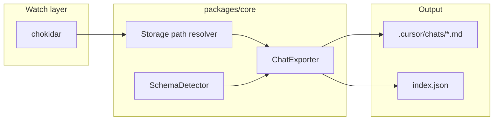

# Plan: Implement cursor-logs (from Notion)

**Product name (locked):** **cursor-logs** — use for repo-facing names, `package.json` / `displayName`, VS Code `publisher` + extension identifier, and Marketplace listing (no alternate public name such as “cursor-sync”).

**Source spec:** [cursor-logs on Notion](https://www.notion.so/34ada311a58e813788fefa34cf85dd89) — vision, file layout, tech stack, roadmap, and explicit non-goals (no git, no V2 import).

**Current repo state:** Only [`.gitignore`](../../.gitignore) and [LICENSE](../../LICENSE) exist; the extension and packages must be created from scratch.

## ESLint and Prettier: if/else and loops (do this first)

**Ordering:** Land the items below **immediately after** a minimal root `package.json` and workspace manifest exist, **before** substantial feature code (path resolver, exporter, extension). Optional rules stay optional; `curly` is **required** for this project.

**Prettier vs ESLint:** Prettier reformats code inside `if`/`else`, `for`, `while`, `do`/`while`, and `for-of`/`for-in` bodies (indentation, line breaks) but does **not** enforce “always use `{}`” on single-line branches. That enforcement is **ESLint**.

### ESLint rules for control flow

- **Required:** [`curly`](https://eslint.org/docs/latest/rules/curly) set to `"all"` — braces required for `if`/`else`, `for`, `while`, `do`.
- **Optional:** [`no-else-return`](https://eslint.org/docs/latest/rules/no-else-return), [`no-lonely-if`](https://eslint.org/docs/latest/rules/no-lonely-if) — shape/cleanup for `if`/`else` chains (e.g. warn level if preferred).
- **Stack:** `@eslint/js` + `typescript-eslint`, flat `eslint.config.js` (or `.mjs`) at repo root, shared via `files` globs for [`packages/core`](../../packages/core) and [`packages/vscode-ext`](../../packages/vscode-ext).
- **Prettier integration:** [`eslint-config-prettier`](https://github.com/prettier/eslint-config-prettier) applied **last** so recommended sets do not fight Prettier. Scripts: `eslint .`, `prettier --check .`, plus `prettier -w` for a `format` script. `languageOptions.parserOptions.project` only if you enable type-aware ESLint rules (optional for V1).
- **Out of scope unless requested:** `max-depth` / `complexity` — global noise, not specific to control-flow formatting.

### Files (root)

- `package.json` devDependencies: `eslint`, `typescript-eslint`, `@eslint/js`, `eslint-config-prettier`, `prettier`; workspace `lint` / `format` scripts.
- `eslint.config.js` — `curly: ["error", "all"]`, TypeScript recommended, `eslintConfigPrettier` last; scope `packages/*/src` (adjust if sources live elsewhere).
- `.prettierrc` (or `prettier` in `package.json`) — minimal, match quote width/style for TS.
- `.prettierignore` — `dist`, `out`, `*.vsix`, lockfiles, etc.

### Verification

From repo root: `pnpm eslint .` and `pnpm prettier --check .` (or npm equivalent). A snippet `if (x) foo();` must **fail** ESLint until wrapped in braces, confirming control-flow brace policy is active.

---

## Target behavior (V1)

- **Single responsibility:** file watch → when chat DBs change, export to the **active workspace** under `.cursor/chats/`.
- **File layout (per spec, refined):**
  - ` .cursor/chats/YYYY-MM-DD_<slugified-title>_<id>.md` — one file per **stable conversation id**; **title in the filename** for quick scanning in the file tree and in `git log` (still diffable; body is the full thread).
  - **Required YAML front matter** at the top of every `.md` (not optional): `title`, `model`, and `updated` (ISO-8601 timestamp). This duplicates some filename/index data on purpose: tools that only read the file (reviewers, static site generators) still get a complete header; `updated` should reflect the last-seen update from DB export. If the DB has no model field, still emit `model: unknown` (or a documented sentinel) so the key is always present.
  - ` .cursor/chats/index.json` — machine-readable index: **stable id → relative path, title, updated time** (so renames when the title changes can update the path while keeping the same id).
- **Export filename rules (implementation):**
  - **Slugify** the title for the filesystem: lower-case or preserve case consistently, strip/replace path-illegal characters (`/ \ : * ? " < > |`), collapse whitespace, cap length (e.g. 60–100 chars) so paths stay under OS limits.
  - **Disambiguation:** if two exports share the same date + title slug, append a **short stable suffix** (first 8 chars of id or full uuid) so names never collide.
  - **Empty/untitled:** fall back to `YYYY-MM-DD_<id>.md` (no empty slug segment).
  - **Title edits:** when the user renames a chat in Cursor, re-export with the new slug; **rename the file** (or remove old + write new) and update `index.json` by **conversation id**, not by old path, so history stays coherent.
- **Databases to watch (read-only):**
  - Per-workspace: `state.vscdb` under Cursor/VS Code workspace storage (path resolution must be **first-class for Windows, macOS, and Linux**).
  - Global: `globalStorage/state.vscdb` (Cursor 3.0 moved chat index here per Notion context — treat as must-watch once paths are known).
- **Resilience:** `better-sqlite3` in readonly mode; **retry with backoff** on `SQLITE_BUSY` / lock.
- **Out of scope (do not build):** any git commands; writing back to SQLite (import) — [cursaves](https://github.com/Callum-Ward/cursaves) confirms Cursor must be closed + full restart for safe writes, so import stays **out of extension scope**.

## Architecture

## Repository layout (proposed)

- **Root:** `package.json` and `pnpm-workspace.yaml` (or npm workspaces) — monorepo root and shared scripts.
- **[`packages/core`](../../packages/core):** Pure Node/TS: path resolution, SQLite read, schema introspection, markdown + index generation — testable without VS Code.
- **[`packages/vscode-ext`](../../packages/vscode-ext):** `package.json` with `contributes`, `extension.ts`: activate, chokidar, debounce, call core, optional minimal UI (status bar or “Export now” command).
- **`schemas/known-schema.json` (or `packages/core/schema/`):** Golden snapshot of `sqlite_master` (and key table signatures) the exporter expects; used by tests and CI.

## Implementation order

1. **Lint and Prettier first (merged tooling):** After initializing root `package.json` + workspace file, add ESLint (flat config, `typescript-eslint`, **`curly: ["error", "all"]`**), Prettier, `eslint-config-prettier` (last), `.prettierrc` / `.prettierignore`, and `lint` / `format` scripts. Verify an unbraced `if` body fails ESLint. No feature modules yet beyond what tooling needs.
2. **Bootstrap monorepo:** TypeScript project references, `packages/core` and `packages/vscode-ext`, `vscode-ext` depending on `core` via workspace protocol; confirm ESLint globs cover all TS sources you add.
3. **Storage path resolver:** Map `vscode.env.appName` / env + OS to:
   - Workspace storage root (to find the folder containing `state.vscdb` for the current window).
   - User global storage path for `globalStorage/state.vscdb`.
   - **Validate on three OSes** (or document + CI matrix for Windows) — per Notion, Windows is first-class.
4. **Reference cursaves / live DB:** Skim [cursaves](https://github.com/Callum-Ward/cursaves) and a **local** Cursor install’s DB (developer machine only) to document actual table/column names for the current Cursor major version; encode assumptions in a small **versioned adapter** (e.g. `adapter/cursor3.ts`) selected by `SchemaDetector`.
5. **SchemaDetector:** Run `PRAGMA table_list` / query `sqlite_master` + sample `SELECT` to detect which adapter applies; log clearly when unknown (no silent corruption).
6. **ChatExporter:** For each **stable conversation id**, build the filename from `YYYY-MM-DD` + **slugified title** + disambiguating id; emit **required YAML front matter** (`title`, `model`, `updated` as ISO-8601) then the message body; write atomically (temp file + rename). On title change, replace the old file for that id (see filename rules above). Rebuild or merge `index.json` in one place to avoid half-written state.
7. **Extension host:** `activate`: resolve paths, attach chokidar to both files (or parent dirs if needed), **debounce** (e.g. 500–1000ms) to avoid export storms, call `ChatExporter` on the workspace `workspaceFolder[0].uri` (or multi-root: export per folder if storage mapping is clear; **V1 can document single-root first** to reduce risk).
8. **Settings:** e.g. `cursorLogs.enabled`, `cursorLogs.outputDirectory` (default `.cursor/chats`), optional `cursorLogs.debounceMs` — align with “opt-in + privacy” in Notion (first-run or README warning for sensitive content).
9. **Tests:** `packages/core` unit tests with **checked-in tiny SQLite fixture** (minimal tables matching one adapter) for exporter + detector; assert every export includes the **three required front-matter keys**; no need to embed real chat text in repo.
10. **CI — schema monitoring (pragmatic V1):**

- **Automated path:** GitHub Action on `schedule` (weekly Monday) that runs a script comparing `sqlite_master` from a **fixture** or from a path supplied by `CURSOR_STATE_DB` secret on a self-hosted runner (full “install Cursor in GHA” is fragile on stock ubuntu).
- **Minimum viable path (recommended to ship first):** commit `known-schema.json` + script `pnpm run schema:dump` (local) that prints diff; weekly workflow runs **only** the diff against the committed file and **opens a workflow failure** or a **“please run schema:dump and PR”** issue — or auto-PR if the job can run the dump in a supported environment.
- Plan should pick one: start with **committed golden + diff job**; upgrade to auto-PR when a reliable dump source exists (Notion’s ideal flow).

11. **Packaging & publish:** `vsce package` / `vsce publish`, README with install, privacy note, and “add `.cursor/chats` to git or `.gitignore` as you prefer.”
12. **Post-launch (Notion “Next steps”):** forum posts to threads linked in the Notion “References” section.

## Key risks (from Notion) and how the plan addresses them

- **Schema drift (High):** versioned adapter + `SchemaDetector` + CI/golden file alert.
- **DB lock (Medium):** readonly + retry/backoff.
- **Privacy (Medium):** README + setting to disable; never upload chats by default.

## Deliverable checklist

- Repo root ESLint + Prettier wired; **`curly: "all"`** enforced on `if`/`else` and loops; Prettier check passes on package sources.
- Importable `packages/core` with tests.
- Every exported `.md` includes **required** YAML front matter: `title`, `model`, `updated`.
- Loadable **cursor-logs** VS Code extension that creates/updates `.cursor/chats/` without touching git.
- Documented path resolution for Win/macOS/Linux.
- Schema baseline + monitoring story (at least golden + scheduled check).
- No import-back, no `git` API usage.
